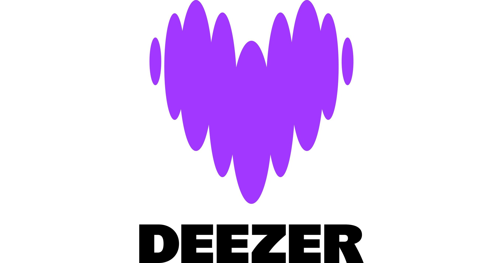

# deezer-llm-search

> Ask questions and recommendations about current music charts in natural language. Powered by Deezer API & Mistral AI

<p align="center">
  
  &nbsp;&nbsp;&nbsp;
  
</p>

---

## What is this?

This tool is a conversational AI that lets you explore music charts the way you would talk to a friend who knows everything about music.

Instead of scrolling through a list of 100 songs, just ask:

- "I want something relaxed with a good BPM"
- "Give me a song to dance to"
- "I need something calm to focus, not too many lyrics"

The app fetches the **Deezer Top 100 World chart**, enriches each track with an AI-generated description (genre, mood, tempo, listening context), indexes everything using semantic embeddings, and lets you have a full conversation about it (adaptable to any Deezer playlist or chart).

---

## Demo

```
=== charts-chat ===

Loading top 100 world...
100 tracks loaded
Enriching 1/100: Juna - Clairo
Enriching 2/100: I Just Might - Bruno Mars
...
Index built with 100 tracks

Ready! Ask me anything about the current world charts.
Type exit to quit.

You: I am looking for something relaxed with a good BPM
Assistant: Here are some chill tracks from the current charts with a solid BPM:
- **Juna** by Clairo: dreamy bedroom pop, ~90 BPM, perfect for winding down without falling asleep.
- **butterflies.** by Brent Faiyaz: smooth R&B/soul, moderate tempo, ideal for a relaxed evening.

You: I want a song to dance!
Assistant: Here are the best tracks to dance to right now:
- **I Just Might** by Bruno Mars: funky and high-energy with brass and a driving rhythm.
- **Get Lucky** by Daft Punk ft. Pharrell Williams: disco-funk classic, guaranteed to get you moving.
- **Slow Motion** by Marshmello: upbeat EDM, steady four-on-the-floor beat, great for any dancefloor.

You: finally I would prefer something to work, slow BPM and not too many lyrics
Assistant: For focus and deep work, here is what fits best from the charts:
- **Juna** by Clairo: minimal dreamy pop, soft synths, very few lyrics — ideal background music.
- **Slow Motion** by Marshmello: mostly instrumental drops, structured EDM without heavy vocals.
```

---

## How it works

1. **Fetch** — pulls the Top 100 World chart from the Deezer API (no authentication required)
2. **Enrich** — for each track, Mistral AI generates a description: genre, mood, tempo, listening context
3. **Index** — descriptions are embedded and stored in ChromaDB for semantic search
4. **Chat** — you ask questions in natural language, the app finds the most relevant tracks and answers conversationally

---

## Architecture

```
Deezer API
    |
    v
fetch.py         — pulls Top 100 World chart
    |
    v
enrich.py        — Mistral AI generates a description per track
    |
    v
index.py         — semantic embeddings + ChromaDB vector store
    |
    v
chat.py          — user question → vector search → Mistral answer
    |
    v
main.py          — entry point, orchestrates everything
```

---

## Adaptability

This project is built around the **Top 100 World chart** but the architecture is fully adaptable:

- Swap the chart source for any Deezer chart (Top France, genre charts, mood playlists)
- Point to any public Deezer playlist by changing the endpoint in 
- With Deezer API authentication, connect to a user private library or personal playlists
- Replace the Deezer API with any music metadata source (Spotify, Last.fm, local MP3 tags)

The enrichment + embedding + chat pipeline stays the same regardless of the source.

---

## Stack

| Component | Technology |
|---|---|
| Music data | Deezer API (public, no auth required) |
| AI descriptions | Mistral AI () |
| Embeddings + search | ChromaDB |
| Conversation | Mistral AI + conversation history |
| Language | Python 3.10+ |

---

## Setup

**1. Clone the repo**
```bash
git clone https://github.com/comersy/deezer-llm-search.git
cd deezer-llm-search
```

**2. Install dependencies**
```bash
pip install -r requirements.txt
```

**3. Set your Mistral API key**

Create a  file:
```
MISTRAL_API_KEY=your_key_here
```
Get your free API key at [console.mistral.ai](https://console.mistral.ai)

**4. Run**
```bash
python main.py
```


---

## Why Deezer API?

Deezer exposes rich public endpoints with no authentication required — charts, genres, artists, albums, playlists. This makes the project instantly runnable by anyone without OAuth flows or premium subscriptions. The API is also well-documented, stable, and covers a global catalog, making it an ideal foundation for music AI projects.
